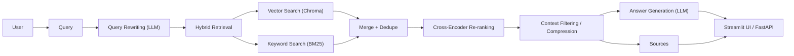

# 🚀 RAG Assistant (Production-Ready)

A portfolio-ready **Retrieval-Augmented Generation (RAG)** system built using **Python, Streamlit, FastAPI, LangChain, and Hugging Face**.

👉 Upload documents → Ask questions → Get answers with sources.

---

# 🧠 Architecture



---

# ⚡ Features

* 📄 Document ingestion (PDF / Website / GitHub)
* 🔍 Hybrid search (Vector + BM25)
* 🧠 Query rewriting using LLM
* 🎯 Cross-encoder re-ranking
* 🧹 Context compression
* 🌍 Multilingual support (English + Hindi/Hinglish)
* 📊 Source transparency
* ⚙️ FastAPI backend support

---

# 🛠 Tech Stack

* **Frontend:** Streamlit
* **Backend:** FastAPI
* **Framework:** LangChain
* **Vector DB:** Chroma
* **Embeddings:** `intfloat/multilingual-e5-large`
* **Re-ranker:** `cross-encoder/ms-marco-MiniLM-L-6-v2`

---

# 🔐 Security Best Practices

* `.env` is **not pushed to GitHub**
* Use environment variables for API keys
* Commit only `.env.example`
* Rotate keys if exposed

---

# 📂 Project Structure

```
rag/
├── app/
├── data/ (ignored)
├── samples/
├── app.py
├── requirements.txt
├── .env.example
├── README.md
```

---

# 🚀 Setup Guide

## 1. Create virtual environment

```bash
python -m venv venv
```

## 2. Activate

```bash
venv\Scripts\activate
```

## 3. Install dependencies

```bash
pip install -r requirements.txt
```

## 4. Setup environment

```bash
copy .env.example .env
```

Edit `.env`:

### 👉 Option 1: Ollama (Local)

```
LLM_PROVIDER=ollama
LLM_MODEL=phi3
```

### 👉 Option 2: OpenAI (Recommended for deployment)

```
LLM_PROVIDER=openai
LLM_MODEL=gpt-4o-mini
OPENAI_API_KEY=your_key_here
```

---

## 5. Run Streamlit

```bash
streamlit run app.py
```

---

## 6. Run FastAPI

```bash
uvicorn app.main:app --reload --port 8000
```

---

# 🧪 Usage

1. Upload document / enter URL
2. Ask question
3. Get:

   * Answer
   * Sources
   * Improved query

---

# 🐳 Docker (Optional)

```bash
docker build -t rag-app .
docker run -p 10000:10000 rag-app
```

---

# 🌐 Deployment

* Backend: Render / Railway
* UI: Streamlit / Vercel (frontend only)
* LLM: OpenAI (recommended for production)

---

# 🎯 Future Improvements

* GitHub repo full ingestion
* Authentication system
* Background job queue
* Evaluation dashboards (RAGAS)

---

# 💡 Author

**Shiva**
AI / GenAI Developer 🚀

---

# ⭐ If you like this project

Give it a ⭐ on GitHub!


